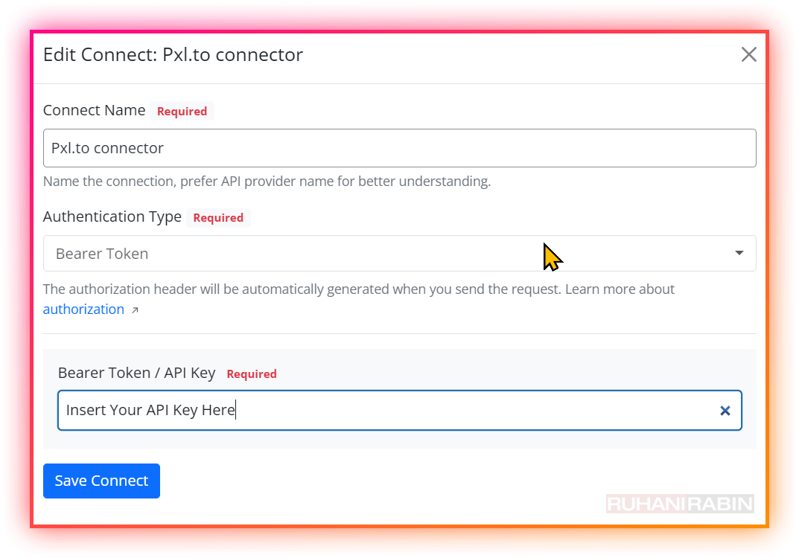
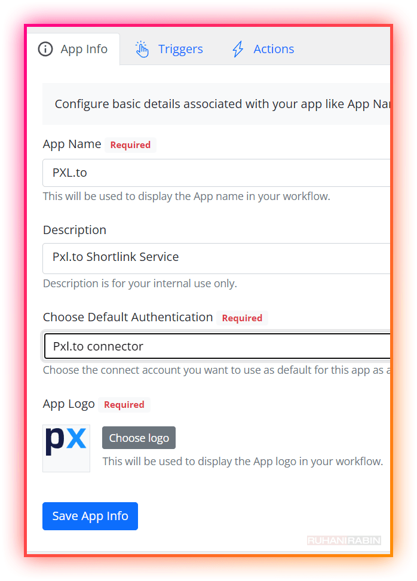

# Flowmattic Custom App for PXL.to link shortener

## How to use? 
- Use the **Connect New API** button on the top right, to create a new Connector in **Flowmattic -> Connects**. 
  - Eg. PXL Connect - Use **Bearer Token** Mode
  - Add in the **PXL API key** in the **API key** field.

- Assign that Connector (to the **Custom App - Settings**)

## What are the actions availble?
- Create Shortlink
- Update Shortlink (not fully tested)
- Read Shortlink (not fully tested)
- Delete Shortlink (not fully tested)
- List Shortlinks (not fully tested)
 

Assign Icon from your own media library.

## How to Install?
- Go to **FlowMattic -> Custom Apps** ->Click the **"Upload" Icon** and **selete the JSON file** in this folder.

