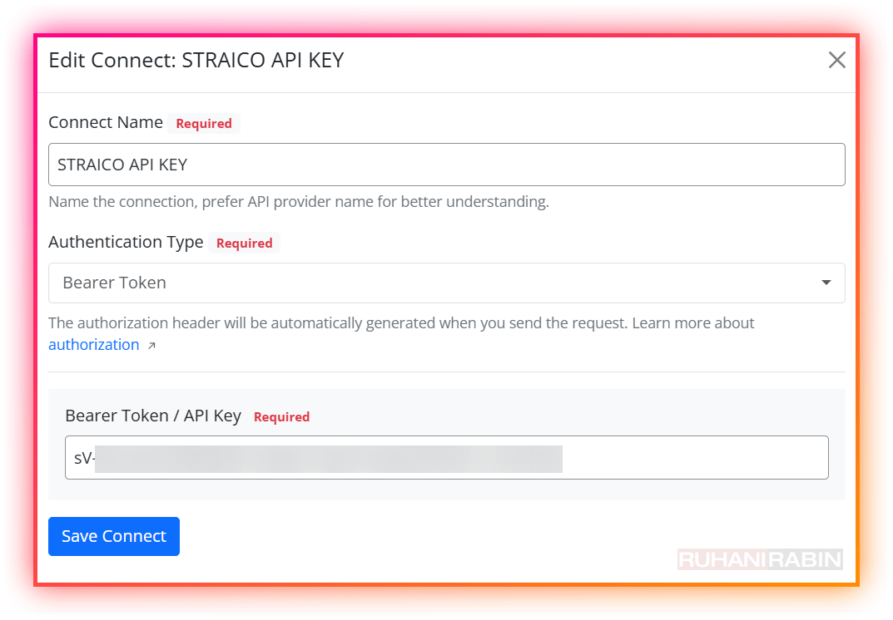
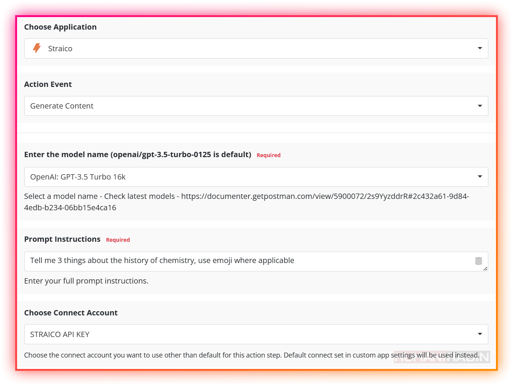
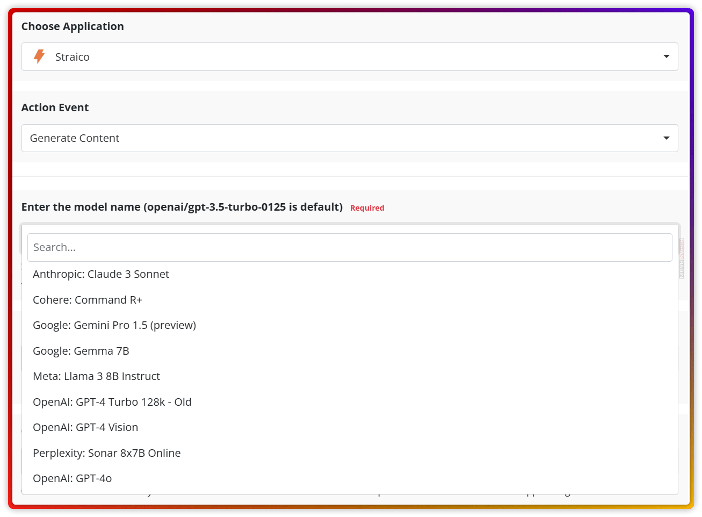

# Flowmattic Custom App for Straico API <!-- omit from toc -->
- [1. How to use?](#1-how-to-use)
- [2. What are the actions availble?](#2-what-are-the-actions-availble)
- [3. How to Install?](#3-how-to-install)

## 1. How to use? 
- Use the **Connect New API** button on the top right, to create a new Connector in **Flowmattic -> Connects**. 
  - Eg. Straico Connect - Use **Bearer Token** Mode
  - Add in the **Straico API key** in the **API key** field.

- Assign that Connector (to the **Custom App - Settings**)

## 2. What are the actions availble?
- "Generate Content"

Assign **Icon** from your **own media library**.

## 3. How to Install?
- Go to **FlowMattic -> Custom Apps** ->Click the **"Upload" Icon** and **selete the JSON file** in this folder.

